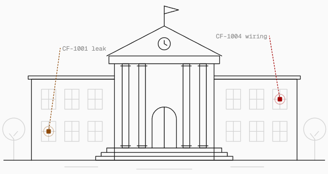
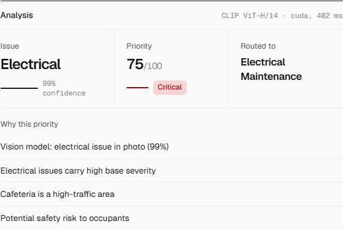
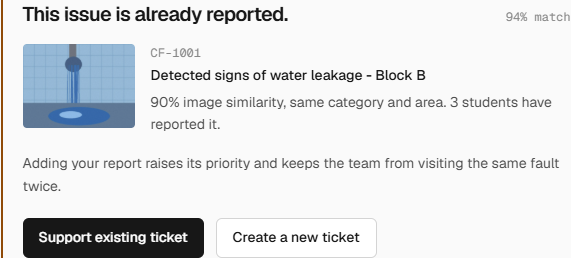
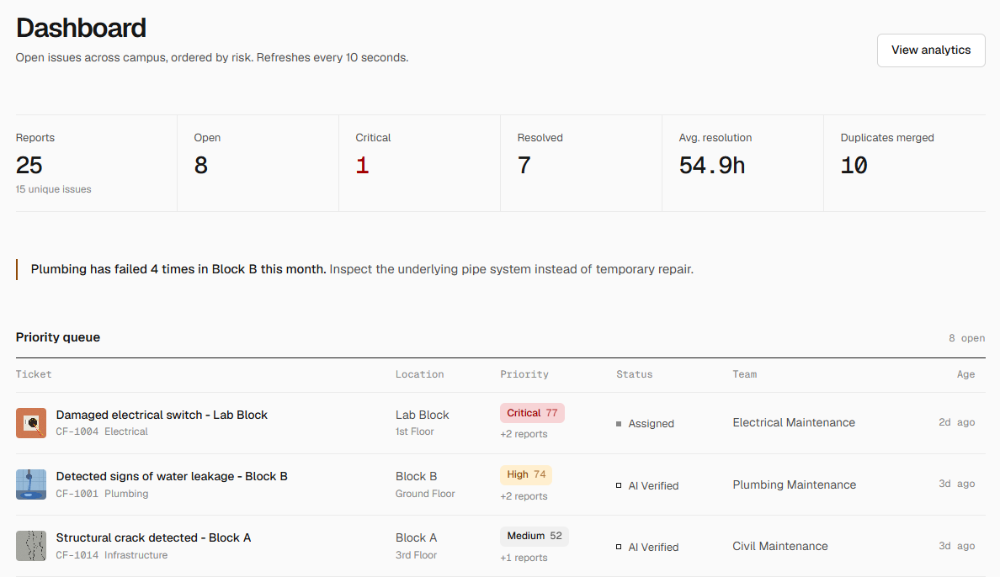
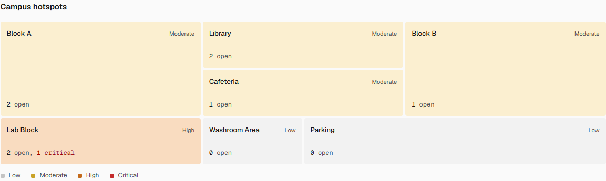
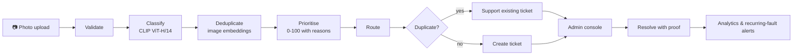

<div align="center">

<picture>
  <source media="(prefers-color-scheme: dark)" srcset="docs/assets/logo-dark.svg">
  
</picture>

### See it. Snap it. Solve it.

**Campus maintenance, triaged from one photo.** A vision model classifies the issue, merges duplicate reports,<br>scores urgency with written reasons and routes the ticket to the team that fixes it, in under a second.

<br>


<br>


**[Features](#features) · [Screenshots](#screenshots) · [How it works](#how-it-works) · [Quick start](#quick-start) · [API](#api-reference) · [Pitch deck](docs/pitch/AIML_TeamAdamya_ReThink26.pdf)**

<br>

<picture>
  <source media="(prefers-color-scheme: dark)" srcset="docs/assets/banner-dark.png">
  
</picture>

<sub>Built by <b>Team Adamya</b> (Dronacharya College of Engineering, Gurugram) for <b>ReThink'26</b>, hosted by Maharaja Agrasen College, University of Delhi · AI/ML vertical</sub>

</div>

---

## Table of contents

- [The problem](#the-problem)
- [The solution](#the-solution)
- [Features](#features)
- [Screenshots](#screenshots)
- [How it works](#how-it-works)
- [The AI model](#the-ai-model)
- [Tech stack](#tech-stack)
- [Project structure](#project-structure)
- [Quick start](#quick-start)
- [API reference](#api-reference)
- [Demo script](#demo-script-7-minutes)
- [Roadmap](#roadmap)
- [Team](#team)

## The problem

Campus maintenance runs on complaint registers, WhatsApp groups and Google Forms.

| | What goes wrong |
|---|---|
| **Unsorted** | Free-text complaints are read, categorised and forwarded by hand. |
| **Duplicated** | The same washroom leak is reported fifteen times as fifteen tasks. |
| **Unprioritised** | A sparking switchboard waits in the same queue as a wobbly chair. |
| **Untracked** | Students never learn if anything was fixed, so they stop reporting. |
| **Unlearned** | The same pipe breaking every week stays invisible. |

## The solution

One photo becomes an **actionable, prioritised, de-duplicated maintenance ticket**, and the maintenance team gets a live console with hotspots and recurring-fault alerts.

| Google Form or register | CampusFix AI |
|---|---|
| Free text, sorted by hand | Classified from the photo by a vision model |
| Same fault reported fifteen times | Duplicates merged into one stronger ticket |
| First come, first served | Explainable, safety-aware priority score (0-100) |
| Admin forwards every message | Routed to the responsible team instantly |
| No idea if it was fixed | Live status, notifications and after-photo proof |
| A spreadsheet at best | Hotspot map and recurring-failure detection |

## Features

**For students**
- 📷 **Report with a photo**: pick a building and floor, add an optional note, get the analysis in about a second.
- 🔁 **Duplicate check before submitting**: if the issue is already reported, support the existing ticket instead, which raises its priority.
- 📍 **Track progress**: a live lifecycle (Reported → AI Verified → Assigned → In Progress → Resolved) plus a **My reports** page.
- 🔔 **In-app notifications** whenever a ticket is assigned, started, re-routed, resolved or supported by someone else.

**For the maintenance team**
- 🧠 **AI classification** into Plumbing, Electrical, Furniture, Sanitation, Infrastructure or Other, with confidence.
- 🚦 **Risk-ordered priority queue** with a 0-100 score and a written reason for every point.
- 🔀 **Department routing** with one-click **re-routing** (logged in the history, reporters notified).
- ✅ **Resolution proof**: close tickets with remarks and an after-photo.
- 📈 **Analytics**: campus hotspot map, recurring-fault alerts, category, building and priority breakdowns, 7-day trend and team workload.

**Platform**
- 🔐 JWT sessions in an **httpOnly cookie**, CSRF guard, role-based access (student / admin).
- 🌗 Light and dark themes, responsive down to phone width, accessible markup.

## Screenshots

<table>
  <tr>
    <td width="50%"><br><sub><b>AI analysis</b>: Electrical, 99% confidence, Critical 75/100, routed to Electrical Maintenance</sub></td>
    <td width="50%"><br><sub><b>Duplicate detection</b>: the photo matches an open ticket before a new one is created</sub></td>
  </tr>
  <tr>
    <td width="50%"><br><sub><b>Admin dashboard</b>: key numbers, recurring-fault alert and the risk-ordered queue</sub></td>
    <td width="50%"><br><sub><b>Campus hotspots</b>: open issues per building, shaded by heat level</sub></td>
  </tr>
</table>

## How it works



| Stage | Code | How it works |
|---|---|---|
| Validate | `backend/app/services/pipeline.py` | Rejects non-images, images under 64 px and files over 8 MB; re-encodes to JPEG, which strips EXIF data. |
| Classify | `backend/app/services/vision_model.py`, `ai_classifier.py` | **Zero-shot CLIP ViT-H/14**: the photo is compared with prompt ensembles per category ("a leaking pipe", "exposed electrical wires", ...). Fused 75/25 with keywords from the student's note; below 35% confidence it goes to *Other* for manual review. |
| Deduplicate | `backend/app/services/duplicate_detector.py` | Cosine similarity of CLIP image embeddings, fused as `0.6·image + 0.25·same category + 0.15·same/nearby building`, against **open** tickets from the **last 14 days**. A score of 0.75 or more is a duplicate. |
| Prioritise | `backend/app/services/priority_engine.py` | Additive, explainable formula (below). |
| Route | `backend/app/services/routing_engine.py` | Category-to-department table; admins can override. |
| Analytics | `backend/app/services/analytics_service.py` | KPIs, hotspot heat levels and recurring-fault detection. |

<details>
<summary><b>Priority formula (0-100)</b></summary>

| Factor | Points |
|---|---|
| Category severity | Electrical 35 · Plumbing 30 · Infrastructure 25 · Sanitation 20 · Furniture/Other 10 |
| Location traffic | High (Block A, Cafeteria, Library) 20 · Medium 12 · Low (Parking) 5 |
| Safety risk | +20 for any electrical issue or safety keywords (spark, wire, shock, fire, leak, slip, flood...) |
| Community reports | +5 per extra student report (max 20) |
| Time pending | +2 per day pending (max 10) |

Levels: **below 30 Low · 30-54 Medium · 55-74 High · 75+ Critical**. Example: exposed wiring with sparks at the Cafeteria scores 35 + 20 + 20 = **75, Critical**; a broken chair in Parking scores 10 + 5 = **15, Low**.

</details>

## The AI model

**[laion/CLIP-ViT-H-14-laion2B-s32B-b79K](https://huggingface.co/laion/CLIP-ViT-H-14-laion2B-s32B-b79K)**, pretrained, no fine-tuning. One forward pass gives both the zero-shot category scores and a 1024-d image embedding for duplicate matching. On an RTX 4050 laptop GPU (fp16) it takes about **29 ms per photo** and **2 GB of VRAM**; it also runs on CPU, just slower.

We picked it by testing three pretrained models on 17 real issue photos (Wikimedia Commons) plus the 6 demo samples:

| Model | Real photos correct | Speed | Re-shot same scene vs. different scene, same category |
|---|:---:|:---:|---|
| CLIP ViT-L/14 (OpenAI) | 17/17 | 18 ms | overlap (gap −0.005) |
| **CLIP ViT-H/14 (LAION-2B)** | **17/17** | **29 ms** | **separated (gap +0.027)** |
| SigLIP 2 so400m (Google) | 17/17 | 49 ms | overlap (gap −0.041) |

All three classify equally well; only ViT-H reliably tells *"the same leak, photographed again"* from *"a different leak"*. With the threshold calibrated on these photos, the real duplicate check caught **17/17 re-shot duplicates with 0/23 false matches** against different scenes of the same category in the same building.

`CAMPUSFIX_MODEL=clip` uses the lighter ViT-L/14 (half the memory); `CAMPUSFIX_MODEL=heuristic` runs a transparent rule-based fallback with no model at all.

## Tech stack

| Layer | Technology |
|---|---|
| **AI** | PyTorch (CUDA), Hugging Face Transformers, CLIP ViT-H/14 (LAION-2B) |
| **Backend** | FastAPI, SQLAlchemy 2, Pydantic 2, Pillow, PyJWT |
| **Frontend** | Next.js 16 (App Router), React 19, TypeScript, Tailwind CSS 4, Recharts, Phosphor icons, Geist |
| **Database** | SQLite for the prototype; set `DATABASE_URL` for Postgres / Supabase (portable column types only) |
| **Storage** | Local `backend/uploads/`; swap for S3 or Supabase Storage |

## Project structure

```
.
├── backend/
│   ├── app/
│   │   ├── main.py              # FastAPI app, routers, static uploads, auto-seed on first run
│   │   ├── database.py          # engine, sessions, data paths
│   │   ├── models.py            # User, Department, Issue, IssueReport, StatusHistory, Resolution, Notification
│   │   ├── schemas.py           # request / response models
│   │   ├── seed.py              # demo accounts and 15 realistic tickets
│   │   ├── sample_images.py     # generated placeholder issue photos
│   │   ├── routers/             # auth, issues, notifications, analytics
│   │   └── services/            # vision_model, ai_classifier, duplicate_detector, priority_engine,
│   │                            # routing_engine, pipeline, tickets, auth, analytics_service
│   ├── tests/
│   │   └── test_pipeline.py     # pipeline, auth and (optional) model checks
│   └── requirements.txt
├── frontend/
│   ├── app/
│   │   ├── (public)/            # landing, login, signup, report, track, my-reports
│   │   └── admin/               # dashboard, tickets, ticket detail, analytics
│   ├── components/              # Header, AnalysisCard, DuplicateAlert, HotspotMap, Charts, ...
│   ├── lib/                     # API client, session, theme
│   ├── types/
│   └── public/samples/          # demo issue photos
└── docs/
    ├── assets/                  # logo and banner
    ├── screenshots/             # README screenshots
    └── pitch/                   # pitch deck (PDF + PPTX)
```

## Quick start

**Prerequisites:** Python 3.10+, Node.js 20+. An NVIDIA GPU is recommended but optional.

### 1. Backend (port 8000)

```bash
cd backend
python -m venv .venv
# Windows: .venv\Scripts\activate   macOS/Linux: source .venv/bin/activate
# GPU: install PyTorch with CUDA first (pytorch.org), e.g. --index-url https://download.pytorch.org/whl/cu124
pip install -r requirements.txt

python -c "from app.services.vision_model import get_model; print(get_model().name)"  # one-time ~4 GB model download
python -m tests.test_pipeline        # self-check (set CAMPUSFIX_TEST_CLIP=1 to also test the model)
uvicorn app.main:app --port 8000
```

The database and demo data are created on first start. API docs: **http://localhost:8000/docs**. Reset the demo data any time with `python -m app.seed`.

### 2. Frontend (port 3000)

```bash
cd frontend
npm install
npm run dev            # or, for demos: npm run build && npm start
```

Open **http://localhost:3000**. Next.js proxies `/api` and `/uploads` to FastAPI, so the browser talks to one origin: no CORS, cookies just work, and phones on the same Wi-Fi can open `http://<laptop-ip>:3000`.

### Demo accounts

The login page has one-click buttons for both.

| Role | Email | Password | Can |
|---|---|---|---|
| Student | `student@campusfix.dev` | `student123` | Report, support duplicates, My reports, tracking, notifications |
| Admin | `admin@campusfix.dev` | `admin123` | Dashboard, all tickets, status changes, re-routing, analytics |

Sign-up always creates a student; admin accounts are provisioned by the college.

### Configuration

| Variable | Default | Purpose |
|---|---|---|
| `SECRET_KEY` | random per start (dev) | Signs session JWTs. Required when `APP_ENV=production`. |
| `APP_ENV` | `development` | `production` makes the session cookie `Secure` and requires `SECRET_KEY`. |
| `CAMPUSFIX_MODEL` | `clip-h` | `clip` (ViT-L/14), `siglip2`, or `heuristic` (no model). |
| `DATABASE_URL` | `backend/campusfix.db` | Point at Postgres / Supabase. |
| `API_ORIGIN` (frontend) | `http://127.0.0.1:8000` | Where Next.js proxies `/api` and `/uploads`. |

> **Tip:** on Windows, run uvicorn without `--reload` for demos; the reloader can leave orphan workers holding port 8000. After schema changes, delete `backend/campusfix.db` once (SQLite tables are created, never altered).

## API reference

Login and signup set an **httpOnly `campusfix_session` cookie** holding a JWT (HS256, 7 days); the token never reaches JavaScript. Cookie-authenticated writes must send `X-Requested-With: campusfix`. API clients may use `Authorization: Bearer <jwt>` instead.

<details>
<summary><b>Endpoints</b> (🔓 public · 👤 logged in · 🛡 admin)</summary>

| Method | Endpoint | Description |
|---|---|---|
| POST | `/api/auth/signup` 🔓 | `name`, `email`, `password`. Creates a student and starts a session. |
| POST | `/api/auth/login` 🔓 | `email`, `password`. Starts a session, returns `{user}`. |
| POST | `/api/auth/logout` 👤 | Ends the session. |
| GET | `/api/auth/me` 👤 | Current user. |
| POST | `/api/analyze` 👤 | Multipart `image`, `building`, `floor`, `description`. Runs the full pipeline. |
| POST | `/api/issues` 👤 | `upload_id`, `building`, `floor`, `description`. Creates the ticket (pipeline re-run server-side). |
| GET | `/api/issues/mine` 👤 | Tickets the user reported or supported. |
| GET | `/api/issues/{id}` 👤 | Ticket detail with reasoning, history and resolution. |
| POST | `/api/issues/{id}/support` 👤 | Merge a duplicate report; re-scores priority. |
| GET | `/api/notifications` 👤 | Latest 20 notifications and the unread count. |
| POST | `/api/notifications/read` 👤 | Mark all as read. |
| GET | `/api/issues` 🛡 | All tickets; filter by `status`, `priority`, `department`, `open_only`; `sort=priority\|recent`. |
| PATCH | `/api/issues/{id}/status` 🛡 | Multipart `status`, `note`, `remarks`, `after_image`. Enforces valid transitions. |
| PATCH | `/api/issues/{id}/department` 🛡 | `department`, `note`. Re-routes, logs and notifies. |
| GET | `/api/departments` 🛡 | Department names. |
| GET | `/api/analytics/overview` 🛡 | KPIs, 7-day trend, recurring-fault insights. |
| GET | `/api/analytics/categories` 🛡 | Counts by category, priority, status and building. |
| GET | `/api/analytics/hotspots` 🛡 | Open and critical counts per building, with heat level. |
| GET | `/api/analytics/departments` 🛡 | Open and resolved counts per department. |
| GET | `/api/public/campus` 🔓 | Aggregate hotspots and insights for the landing page. |
| GET | `/api/health` 🔓 | Status and the loaded model. |

</details>

<details>
<summary><b>Example <code>/api/analyze</code> response</b></summary>

```json
{
  "category": "Plumbing",
  "confidence": 0.99,
  "priority": "High",
  "priority_score": 57,
  "department": "Plumbing Maintenance",
  "duplicate_found": true,
  "duplicate_issue_id": "CF-1001",
  "similarity": 0.93,
  "image_similarity": 0.88,
  "reasoning": [
    "Vision model: plumbing issue in photo (100%)",
    "Plumbing issues carry high base severity",
    "Similar open issue CF-1001 exists nearby (93% match)"
  ],
  "model": "CLIP ViT-H/14 · cuda"
}
```

</details>

## Demo script (7 minutes)

Run `python -m app.seed` in `backend/` right before presenting so the data is fresh.

1. **Landing (30s).** Tagline, "One photo in. A routed ticket out." and the Google Form comparison.
2. **Student login (10s).** **Log in**, then **Continue as student**.
3. **Duplicate path (90s).** *Water leak* sample at **Block B**, **Analyze photo**: Plumbing, 99% confidence, priority with reasons, *CLIP ViT-H/14 · cuda*, then **"This issue is already reported."** matched to CF-1001.
4. **Support existing ticket**: the tracking page shows the merged report and escalated priority.
5. **New issue (60s).** *Exposed wiring* at **Cafeteria**, note "wires hanging, saw sparks": Electrical, Critical. **Create ticket**.
6. **Switch to admin (10s).** Avatar menu, **Log out**, **Continue as admin**: the new ticket is highlighted in the queue.
7. **Recurring-fault alert**: "Plumbing has failed 4 times in Block B this month."
8. **Admin actions (90s).** Re-route with **Change**, then **Start work** and **Mark resolved** with remarks.
9. **Notifications (30s).** Back as the student, open the **bell**.
10. **Analytics (30s).** Hotspot map, breakdowns, trend and workload.

<details>
<summary><b>Jury Q&A cheat sheet</b></summary>

- **Why not a Google Form?** A form only collects. CampusFix classifies, de-duplicates, prioritises, routes and verifies, and learns where things keep breaking.
- **How does the AI add value?** No manual triage, fewer wasted visits from duplicates, safety risks first, root causes surfaced.
- **How are duplicates detected?** CLIP image embeddings and cosine similarity, fused with category, location and a 14-day window over open tickets; the student decides whether to support or create.
- **How is priority calculated?** An additive formula where every point has a written reason, visible on the ticket.
- **What if the AI is wrong?** Confidence is shown, low-confidence photos go to manual review, admins re-route in one click, and the server never trusts client-supplied categories.
- **How does it scale?** Swap the location and routing tables for any campus, hospital, office or ward; move to Postgres + pgvector and object storage. The API is stateless.

</details>

## Roadmap

- [x] Vision-model classification and semantic duplicate detection (CLIP ViT-H/14)
- [x] Explainable priority scoring, routing and admin re-routing
- [x] JWT cookie auth, in-app notifications, analytics and hotspots
- [ ] Fine-tune the model on real campus photos
- [ ] SLA timers that auto-escalate overdue tickets
- [ ] WhatsApp and email alerts, college single sign-on
- [ ] AI check of after-photos (did the leak actually stop?)
- [ ] QR codes per room for automatic location tagging; offline-capable PWA
- [ ] pgvector embeddings and multi-campus tenancy

## Team

**Team Adamya** · Dronacharya College of Engineering (DCE), Gurugram

| Name | Role |
|---|---|
| **Parth Sharma** | Team lead · AI, backend & frontend |
| Shrey Kataria | Testing & QA |
| Aishwarya Upadhyay | Pitch deck & design |
| Shresth Kataria | Data & photo collection |
| Monishka Yadav | Research & documentation |

📑 Pitch deck: [`docs/pitch/AIML_TeamAdamya_ReThink26.pdf`](docs/pitch/AIML_TeamAdamya_ReThink26.pdf)

## Acknowledgements

- [LAION](https://laion.ai/) and [OpenAI](https://github.com/openai/CLIP) for the CLIP models, served through [Hugging Face Transformers](https://huggingface.co/docs/transformers)
- [Phosphor Icons](https://phosphoricons.com/) and the [Geist](https://vercel.com/font) typeface
- Evaluation photos from [Wikimedia Commons](https://commons.wikimedia.org/)

<div align="center"><sub>Demo issue photos in <code>frontend/public/samples/</code> are generated placeholders; swap in real campus photos for a live demo.</sub></div>
