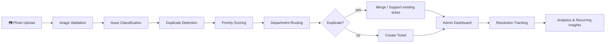

# CampusFix AI

> **See it. Snap it. Solve it.**
> AI-powered campus infrastructure reporting and maintenance intelligence.

Built for **ReThink'26** · Maharaja Agrasen College, University of Delhi · Vertical: AI/ML

---

## Problem statement

Campus maintenance runs on complaint registers, WhatsApp groups and Google Forms. As a result:

- **Nobody sorts reports.** Free-text complaints have to be read, categorised and forwarded by hand.
- **Duplicates pile up.** The same washroom leak gets reported 15 times, and nobody knows it's one problem.
- **There's no prioritisation.** A spark from a switchboard waits behind a wobbly chair.
- **There's no feedback loop.** Students never learn whether anything was fixed, so they stop reporting.
- **Nothing is learned.** Recurring failures, like the same pipe breaking every week, stay invisible.

## Solution overview

CampusFix AI turns **one photo** into an **actionable, prioritised, de-duplicated maintenance ticket** in under a second. It also gives the maintenance team a live dashboard with hotspots and recurring-problem insights.

| Google Form | CampusFix AI |
|---|---|
| Free text, sorted by hand | Auto-classified from the photo + description |
| Same leak reported 15× | Duplicates merged into one stronger ticket |
| First-come-first-served | Explainable, safety-aware priority score (0–100) |
| Admin forwards emails | Instant routing to the responsible department |
| "Was it fixed?" | Live status tracking with after-photo proof |
| A spreadsheet at best | Hotspot map + recurring-failure detection |

## Key features

- **AI issue detection** with a pretrained **CLIP ViT-H/14** vision model (Hugging Face, runs on the GPU) classifies photos as Plumbing, Electrical, Furniture, Sanitation, Infrastructure or Other, with a confidence score.
- **Duplicate complaint merging** compares CLIP image embeddings by cosine similarity, so the same leak photographed from a different angle still matches. It's fused with category, location and recency.
- **Smart priority scoring** gives an explainable score from 0 to 100 and a Low/Medium/High/Critical level. Every point comes with a human-readable reason.
- **Department routing** sends each ticket to the right maintenance team automatically; admins can **re-route** with a reason, logged in the history.
- **In-app notifications**: a bell in the navbar tells students when their tickets are assigned, started, re-routed, resolved or supported by others.
- **Ticket lifecycle**: Reported → AI Verified → Assigned → In Progress → Resolved (or Reopened). Every change is recorded in the status history.
- **Resolution verification** lets the admin attach remarks and an after-photo, so each ticket shows before and after.
- **Admin dashboard** has KPI cards, an AI-ordered priority queue, recent reports, department workload and status overview. It refreshes every 10 seconds.
- **Analytics** cover category, building, priority and resolution trends, plus a **campus hotspot map** and **recurring-problem detection**.

## Demo accounts

The login page has one-click buttons for both accounts.

| Role | Email | Password | Can |
|---|---|---|---|
| Student | `student@campusfix.dev` | `student123` | Report issues, support duplicates, see **My reports**, track tickets |
| Admin | `admin@campusfix.dev` | `admin123` | Dashboard, all tickets, status changes, analytics |

Sign-up always creates a **student**; admin accounts are provisioned by the college (seeded here).

## AI pipeline



| Stage | File | How it works |
|---|---|---|
| Image validation | `services/pipeline.py` | Rejects non-images, images under 64px and files over 8 MB. Re-encodes to JPEG, which strips EXIF data. |
| Classification | `services/vision_model.py`, `services/ai_classifier.py` | **CLIP ViT-H/14 zero-shot**: the photo is compared with prompt ensembles per category ("a leaking pipe", "exposed electrical wires", ...). Probabilities are fused 75/25 with keywords from the description. Below 35% confidence it goes to *Other, manual review*. |
| Duplicate detection | `services/duplicate_detector.py` | **Cosine similarity of CLIP image embeddings** (rescaled from the useful 0.5-1.0 band). Score = `0.6·image + 0.25·same category + 0.15·same/nearby location`, checked only against **open** tickets from the **last 14 days**. A score ≥ 0.75 is treated as a duplicate. Falls back to a 64-bit dHash when the model is off. |
| Priority scoring | `services/priority_engine.py` | See the formula below. |
| Routing | `services/routing_engine.py` | Rule table mapping each category to a department. |
| Analytics | `services/analytics_service.py` | KPIs, hotspot heat levels and recurring-issue detection. |

### Priority formula (0–100, explainable)

| Factor | Points |
|---|---|
| Category severity | Electrical 35 · Plumbing 30 · Infrastructure 25 · Sanitation 20 · Furniture/Other 10 |
| Location traffic | High (Block A, Cafeteria, Library) 20 · Medium 12 · Low (Parking) 5 |
| Safety risk | +20 for any electrical issue or safety keywords (spark, wire, shock, fire, leak, slip, flood…) |
| Community reports | +5 per duplicate/support report (max 20) |
| Time pending | +2 per day pending (max 10) |

Levels: **< 30 Low · 30–54 Medium · 55–74 High · ≥ 75 Critical**.

Example: exposed wiring with sparks in the Cafeteria scores 35 + 20 + 20 = **75, Critical**. A broken chair in Parking scores 10 + 5 = **15, Low**.

### The model

- **[laion/CLIP-ViT-H-14-laion2B-s32B-b79K](https://huggingface.co/laion/CLIP-ViT-H-14-laion2B-s32B-b79K)**, pretrained, no fine-tuning: zero-shot classification plus 1024-d image embeddings from one forward pass.
- On an RTX 4050 laptop GPU (fp16): about **29 ms per photo**, about **2 GB VRAM**. On CPU it still works, just slower.
- **Why this model:** we compared three on 17 real photos (Wikimedia Commons) plus the 6 demo samples:

  | Model | Real photos correct | Speed | Re-shot same scene vs. other scene, same category |
  |---|---|---|---|
  | CLIP ViT-L/14 (OpenAI) | 17/17 | 18 ms | overlap (gap −0.005) |
  | **CLIP ViT-H/14 (LAION-2B)** | **17/17** | 29 ms | **separated (gap +0.027)** |
  | SigLIP 2 so400m (Google) | 17/17 | 49 ms | overlap (gap −0.041) |

  All three classify equally well; only ViT-H cleanly tells "same leak, photographed again" from "a different leak". With the duplicate cut-off calibrated on these photos, the real duplicate check caught **17/17 re-shot duplicates with 0/23 false matches** against different scenes of the same category in the same building.
- `CAMPUSFIX_MODEL=heuristic` switches to the transparent rule-based fallback (keywords + colour statistics, dHash duplicates), so it also runs on any laptop.
- **Next:** fine-tune on real campus photos, store embeddings in **pgvector**, and learn the priority weights from resolution history.

## Tech stack

| Layer | Tech |
|---|---|
| Frontend | Next.js 16 (App Router), React 19, TypeScript, Tailwind CSS 4, Recharts, Phosphor icons |
| Backend | FastAPI, SQLAlchemy 2, Pydantic 2, Pillow, PyJWT |
| AI | PyTorch (CUDA), Hugging Face Transformers, CLIP ViT-H/14 (LAION-2B) |
| Database | SQLite (prototype). Set `DATABASE_URL` to Postgres/Supabase to migrate; the models use only portable types. |
| Storage | Local `backend/uploads/` (swap for S3 / Supabase Storage) |

## Architecture

```
MAIT/
├── backend/
│   ├── main.py               # FastAPI app, CORS, static uploads, auto-seed on first run
│   ├── database.py           # engine/session, DATABASE_URL, upload dir
│   ├── models.py             # User, Department, Issue, IssueReport, StatusHistory, Resolution, Notification
│   ├── schemas.py            # Pydantic request/response models
│   ├── routers/
│   │   ├── auth.py           # signup, login, logout, me (JWT cookie)
│   │   ├── issues.py         # analyze, create, list, detail, status, support, re-route
│   │   ├── notifications.py  # in-app notifications
│   │   └── analytics.py      # overview, categories, hotspots, departments, public campus
│   ├── services/
│   │   ├── pipeline.py       # validation + orchestrates the AI stages
│   │   ├── vision_model.py   # CLIP ViT-H/14 on GPU: zero-shot + embeddings
│   │   ├── auth.py           # PBKDF2 passwords, JWT cookie sessions, CSRF guard
│   │   ├── ai_classifier.py
│   │   ├── duplicate_detector.py
│   │   ├── priority_engine.py
│   │   ├── routing_engine.py
│   │   ├── analytics_service.py
│   │   └── tickets.py        # lifecycle: create / merge / transitions / serialize
│   ├── seed.py               # 15 realistic demo tickets with history
│   ├── sample_images.py      # generates placeholder issue photos
│   └── test_pipeline.py      # self-check for the AI pipeline
└── frontend/
    ├── app/(public)/         # landing, /report, /track, /track/[id]
    ├── app/admin/            # dashboard, /issues, /issues/[id], /analytics
    ├── components/           # AnalysisCard, DuplicateAlert, HotspotMap, Charts, ...
    ├── lib/api.ts            # typed API client
    └── types/index.ts
```

## Setup

**Prerequisites:** Python 3.10+, Node.js 20+.

### Backend (port 8000)

```bash
cd backend
python -m venv .venv
# Windows: .venv\Scripts\activate    macOS/Linux: source .venv/bin/activate
# GPU (recommended): install PyTorch with CUDA first, see pytorch.org (e.g. --index-url https://download.pytorch.org/whl/cu124)
pip install -r requirements.txt
python -c "from services.vision_model import get_model; print(get_model().name)"   # one-time ~4 GB model download
python test_pipeline.py              # rules + auth self-check (add CAMPUSFIX_TEST_CLIP=1 to test the model)
uvicorn main:app --port 8000
```

On first start, the database is created and seeded automatically, and the sample images are written to `frontend/public/samples/`. Interactive API docs are at **http://localhost:8000/docs**.

To reset the demo data, delete `backend/campusfix.db` and restart, or run `python seed.py`. **After pulling schema changes (for example the auth tables), delete `campusfix.db` once.** SQLite tables are created, never altered.

Environment:

| Variable | Default | Purpose |
|---|---|---|
| `SECRET_KEY` | random per start (dev) | Signs session JWTs. **Required** when `APP_ENV=production`. |
| `APP_ENV` | `development` | `production` makes the session cookie `Secure` and requires `SECRET_KEY`. |
| `CAMPUSFIX_MODEL` | `clip-h` | `clip` (ViT-L/14, half the memory), `siglip2`, or `heuristic` (no model, rules only). |
| `DATABASE_URL` | SQLite file | Point at Postgres/Supabase. |

Tip: run uvicorn without `--reload` for demos on Windows; the reloader can leave orphan workers holding port 8000.

### Frontend (port 3000)

```bash
cd frontend
npm install
npm run dev          # or: npm run build && npm start
```

Open **http://localhost:3000**. The Next server proxies `/api` and `/uploads` to FastAPI (`next.config.ts`), so the browser only talks to one origin: no CORS, cookies just work, and phones on the same Wi-Fi can open `http://<laptop-ip>:3000`. If FastAPI runs elsewhere, set `API_ORIGIN` (default `http://127.0.0.1:8000`).

## API documentation

Auth: login/signup set an **httpOnly `campusfix_session` cookie** holding a JWT (HS256, 7 days); the token never reaches JavaScript. Cookie-authenticated writes must send `X-Requested-With: campusfix` (CSRF guard, on top of SameSite=Lax). API clients may use `Authorization: Bearer <jwt>` instead. 🔓 = public, 👤 = any logged-in user, 🛡 = admin only.

| Method | Endpoint | Description |
|---|---|---|
| POST | `/api/auth/signup` 🔓 | JSON: `name`, `email`, `password`. Creates a student, sets the session cookie, returns `{user}` |
| POST | `/api/auth/login` 🔓 | JSON: `email`, `password`. Sets the session cookie, returns `{user}` |
| POST | `/api/auth/logout` 👤 | Clears the session cookie |
| GET | `/api/notifications` 👤 | Latest 20 notifications plus the unread count |
| POST | `/api/notifications/read` 👤 | Mark all as read |
| GET | `/api/departments` 🛡 | Department names |
| PATCH | `/api/issues/{id}/department` 🛡 | JSON: `department`, `note?`. Re-routes the ticket, logs it, notifies reporters |
| GET | `/api/auth/me` 👤 | Current user |
| GET | `/api/issues/mine` 👤 | Tickets the user reported or supported |
| GET | `/api/public/campus` 🔓 | Aggregate hotspots and recurring insights for the landing page |
| POST | `/api/analyze` 👤 | multipart: `image`, `building`, `floor`, `description`. Runs the full AI pipeline and returns the analysis plus an `upload_id`. |
| POST | `/api/issues` 👤 | JSON: `upload_id`, `building`, `floor`, `description`. Creates the ticket (the pipeline is re-run server-side). |
| GET | `/api/issues` 🛡 | Query: `status`, `priority`, `department`, `open_only`, `sort=priority\|recent` |
| GET | `/api/issues/{id}` 👤 | Ticket detail: reasoning, history, reports, resolution |
| PATCH | `/api/issues/{id}/status` 🛡 | multipart: `status`, `note`, `remarks`, `after_image`. Enforces valid lifecycle transitions. |
| POST | `/api/issues/{id}/support` 👤 | JSON: `upload_id?`, `note?`. Merges a duplicate report and re-scores the priority. |
| GET | `/api/analytics/overview` 🛡 | KPIs, 7-day trend, recurring insights |
| GET | `/api/analytics/categories` 🛡 | Counts by category, priority, status and building |
| GET | `/api/analytics/hotspots` 🛡 | Per-building open/critical counts and heat level |
| GET | `/api/analytics/departments` 🛡 | Open/resolved counts per department |

Example `/api/analyze` response:

```json
{
  "category": "Plumbing",
  "confidence": 0.9,
  "priority": "Critical",
  "priority_score": 77,
  "department": "Plumbing Maintenance",
  "duplicate_found": true,
  "duplicate_issue_id": "CF-1001",
  "similarity": 0.99,
  "reasoning": [
    "Detected signs of water leakage",
    "Blue/water-toned regions in image",
    "Plumbing issues carry high base severity",
    "Slip hazard from water on floor",
    "3 additional student report(s) on the same issue",
    "Similar open issue CF-1001 exists nearby (99% match)"
  ]
}
```

## Demo flow (7 minutes)

Run `python seed.py` in `backend/` just before presenting so the data is fresh.

1. **Landing page (30s).** Read the tagline, scroll to "One photo in. A routed ticket out." and the "Why not a Google Form?" table.
2. **Log in as a student (10s).** Click **Log in**, then **Continue as student**. You land on **Report an issue**.
3. **Duplicate path (90s).** Pick the *Water leak* sample, choose **Block B**, and click **Analyze photo**. Show the pipeline steps, then the result: **Plumbing, 99% confidence**, the priority with its written reasons, routed to **Plumbing Maintenance**, and the model caption **CLIP ViT-H/14 · cuda**. Below it: **"This issue is already reported."** with the match to **CF-1001**.
4. Click **Support existing ticket**. The tracking page shows the merged report and the escalated priority.
5. **New-issue path (60s).** Report the *Exposed wiring* sample at **Cafeteria** and type "wires hanging, saw sparks". It comes back **Electrical, Critical** and routed to **Electrical Maintenance**. Click **Create ticket**.
6. **Switch to admin (10s).** Open the avatar menu, **Log out**, then **Continue as admin**. The new ticket is highlighted near the top of the **priority queue**.
7. Point out the **recurring-fault alert**: "Plumbing has failed 4 times in Block B this month. Inspect the underlying pipe system instead of temporary repair."
8. **Admin actions (90s).** Open the new ticket. Use **Change** next to *Team* to re-route it with a reason (it appears in the history). Then **Start work** and **Mark resolved** with remarks, optionally an after-photo.
9. **Notifications (30s).** Log back in as the student and open the **bell**: every update to their tickets is listed there.
10. **Analytics (30s).** As admin, open **Analytics** for the hotspot map, category, building and priority breakdowns, the 7-day trend and team workload.

## Jury Q&A cheat sheet

- **Why not Google Forms?** A form only collects reports. CampusFix also classifies, de-duplicates, prioritises, routes and verifies them, and it learns where things keep breaking.
- **How does AI add value?** It removes manual triage, merges duplicates (fewer wasted visits), puts safety risks first and surfaces root causes through recurring detection.
- **How are duplicates detected?** Image embedding plus cosine similarity, fused with category, location proximity and a 14-day window over open tickets. The student decides: support the existing ticket or create a new one.
- **How is priority calculated?** With the additive, explainable formula above. Every point has a reason, which you can see on the ticket.
- **What if the AI is wrong?** Confidence is shown, low-confidence photos fall back to *Other → General Admin*, and admins can re-route in one click (logged and notified). The server re-runs the pipeline itself and never trusts client-supplied categories.
- **How does it scale?** It works for colleges, offices, hospitals, housing societies and municipal wards: swap the `LOCATIONS` and `ROUTES` tables, move to Postgres + pgvector and object storage. The API is stateless, so it scales horizontally.

## Future scope

- Fine-tuned vision model (MobileNet/YOLO) trained on real campus photos, plus CLIP embeddings for semantic duplicate detection.
- College SSO (OAuth) on top of the JWT sessions, email/WhatsApp/push alongside the in-app notifications, and SLA timers with auto-escalation.
- AI verification of after-photos (did the leak actually stop?).
- Predictive maintenance: forecasting failures from recurring patterns.
- QR codes in each room so a report is location-tagged automatically. A PWA with offline capture.
- Multi-tenant setup for multiple campuses and municipalities.

## Team

**Team Adamya**, Dronacharya College of Engineering (DCE), Gurugram

| Name | Role | Passout year |
|---|---|---|
| Parth Sharma | Team lead · AI, backend & frontend | 2029 |
| Shrey Kataria | Testing & QA | 2029 |
| Aishwarya Upadhyay | Pitch deck & design | 2028 |
| Shresth Kataria | Data & photo collection | 2029 |
| Monishka Yadav | Research & documentation | 2029 |

Pitch deck: `pitch/AIML_TeamAdamya_ReThink26.pdf`

---

*Sample issue images are procedurally generated placeholders. Replace them with real campus photos in `frontend/public/samples/` before the final demo.*
